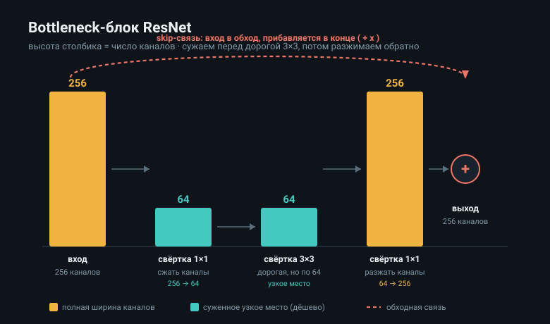

## ResNet и современные CNN-backbone

Большая картина. Из прошлого билета мы знаем, что глубина помогает: чем больше слоёв, тем сложнее признаки. Но тут есть подвох, на который наткнулись около 2015 года: если просто ставить всё больше слоёв, в какой-то момент сеть начинает учиться хуже, а не лучше. ResNet нашла, в чём дело, и починила это одной простой идеей, обходными связями. Этот билет про эту идею и её развитие: что такое skip-связь и остаточный блок, как удешевляют глубину через bottleneck, и какие приёмы делают современные опорные сети, backbone, эффективными. Слово backbone тут значит базовую сеть-извлекатель признаков, на которую навешивают конкретную задачу.

### Проблема: глубже стало хуже

Сначала про беду, ради которой всё затевалось, иначе не понять решения. Казалось бы, добавляешь слои, сеть становится мощнее. Но на практике у очень глубоких сетей качество не росло, а падало, причём не из-за переобучения, а прямо на обучающих данных. Сеть из 56 слоёв училась хуже, чем из 20.

Это звучит абсурдно, разберём почему так. Логически глубокая сеть должна быть не хуже мелкой: лишние слои могли бы просто ничего не менять, передавать вход как есть, и тогда глубокая работала бы как мелкая. Но беда в том, что обычному слою трудно научиться ничего не менять, то есть выдать на выходе ровно то, что пришло на вход. Передать вход без искажений, это называют тождественным преобразованием, для слоя на удивление сложно, он всегда что-то да перекручивает. Поэтому лишние слои не сидели тихо, а портили сигнал, и чем их больше, тем сильнее портили. Вдобавок в глубокой сети сигнал обучения, градиент, идя назад через десятки слоёв, ослабевал до того, что ранние слои почти переставали учиться, это называют затуханием градиента.

### Skip connection: обходная связь

Теперь решение ResNet, и оно поразительно простое. Раз слою трудно научиться передавать вход без изменений, давайте дадим входу обойти слой напрямую и прибавим его к выходу. Эту прямую перемычку называют обходной, или пропускающей связью, skip connection.

Что это значит в формуле. Пусть слой делает над входом $x$ какое-то преобразование $F(x)$. В обычной сети дальше идёт просто $F(x)$. В ResNet дальше идёт сумма преобразования и самого входа:

$$
y = F(x) + x
$$

Прочитаем словами. Выход блока это то, что насчитал слой, плюс исходный вход, проброшенный в обход. Вот это прибавление $x$ и есть skip-связь: вход перепрыгивает через слой по короткой дороге и складывается с результатом.

Почему это чинит проблему, тут главная мысль. Теперь, чтобы блок ничего не менял, слою достаточно выдать ноль: если $F(x)$ равно нулю, то выход это просто $x$, чистый вход. А выучить ноль слою легко, куда легче, чем выучить точную передачу входа. То есть передать вход без изменений теперь дёшево по умолчанию, и лишние слои больше не портят сигнал, в худшем случае они зануляются и пропускают вход дальше. Поэтому глубина перестала вредить, и сети сразу выросли до сотен слоёв.

И второй выигрыш, про обучение. Skip-связь даёт градиенту короткую дорогу назад: он течёт не только через слой, но и напрямую по перемычке. Поэтому он не затухает на глубине, и ранние слои продолжают учиться. Одна перемычка решила обе беды разом.

### Residual block: что на самом деле учит слой

Теперь поймём, почему подход называют остаточным, residual, это проясняет всю идею. Перепишем ту же формулу под другим углом. Раз выход это $F(x) + x$, значит слой учит не сам желаемый выход, а только разницу между желаемым выходом и входом:

$$
F(x) = y - x
$$

Эту разницу и называют остатком, residual, отсюда название. Смысл такой: слою не надо строить ответ с нуля, ему надо лишь подправить вход, добавить к нему поправку. А подправлять то, что уже почти готово, легче, чем строить всё заново. Блок, устроенный как преобразование плюс проброшенный вход, и называют остаточным блоком, residual block, и из стопки таких блоков собрана вся ResNet.

Аналогия для интуиции. Представь, что надо отредактировать почти готовый текст. Проще дописать правки поверх него, чем переписывать весь текст с нуля. Обычный слой как бы переписывает заново, остаточный лишь дописывает поправку к тому, что пришло. Поэтому ему проще и он не ломается на глубине.

### Bottleneck: удешевить глубокий блок

Теперь практический приём, без которого очень глубокие ResNet были бы неподъёмными. Когда блоков сотни и каналов много, дорогая свёртка 3 на 3 на полной глубине каналов стоит слишком много. Идея bottleneck в том, чтобы сжать каналы перед дорогой операцией и разжать после.

Слово bottleneck значит бутылочное горлышко, сужение. Блок устроен из трёх свёрток по порядку. Первая это свёртка 1 на 1, которая уменьшает число каналов, например со 256 до 64, это сужение. Вторая это свёртка 3 на 3, но она теперь работает по суженной стопке в 64 канала, а не по полным 256, и потому дёшева. Третья это снова свёртка 1 на 1, которая разжимает каналы обратно до 256. И всё это в остаточном блоке, с проброшенным входом поверх.

Зачем так. Самая дорогая операция, 3 на 3, выполняется в узком месте, где каналов мало, а дешёвые свёртки 1 на 1 лишь сжимают и разжимают вокруг неё. Вспомни из прошлых билетов, что свёртка 1 на 1 меняет число каналов дёшево, а основная стоимость сидит в перемножении каналов на крупное окно. Bottleneck убирает это перемножение из дорогого места, проведя 3 на 3 по сжатой стопке. Так глубокая сеть из сотни блоков остаётся подъёмной по вычислениям. Именно на bottleneck-блоках построены глубокие версии ResNet, на 50, 101 и 152 слоя.

### Идеи эффективных архитектур

Теперь короткий обзор, куда пошли опорные сети после ResNet, потому что дальше развитие крутилось вокруг одного: дать больше качества за меньшую цену. Перечислю главные идеи, многие из них мы уже встречали.

Разделимые свёртки. Разбить обычную свёртку на пространственный шаг по каждому каналу и канальный шаг окном 1 на 1, что даёт многократную экономию. На этом стоит MobileNet, опорная сеть для телефонов, где важна дешевизна.

Сжатие через bottleneck и свёртки 1 на 1. Та самая идея сужать каналы перед дорогими операциями, ставшая общим приёмом почти во всех эффективных сетях.

Согласованное масштабирование. Вопрос, как растить сеть: делать глубже, шире или принимать картинку крупнее. Сеть EfficientNet показала, что эти три оси надо растить согласованно, в правильной пропорции, а не одну в отрыве от других, и так получается лучшее качество на единицу вычислений.

Внимание к каналам. Добавить в блок маленький механизм, который смотрит, какие каналы сейчас важнее, и усиливает их, а неважные приглушает. Это дешёвая добавка, заметно поднимающая качество, её принёс блок squeeze-and-excitation.

Через все эти идеи проходит одна нить: не наращивать слепо размер, а тратить вычисления с умом, сжимая там, где дорого, и усиливая то, что полезно. Стоит добавить, что позже к опорным сетям для картинок подключились и трансформеры, зрительные трансформеры, но это уже отдельная история, а перечисленное это эволюция именно свёрточных backbone.

### Как это всё связано

Соберём в одну картину. Глубина упёрлась в проблему: очень глубокие сети учились хуже, потому что обычному слою трудно просто передать вход, и градиент затухал. ResNet починила это skip-связью, прямой перемычкой, по которой вход обходит слой и складывается с его выходом, так что слою достаточно выучить лишь поправку, остаток, а не строить ответ заново, и градиент течёт по короткой дороге не затухая. Bottleneck сделал глубокие блоки дешёвыми, сжимая каналы свёрткой 1 на 1 перед дорогой 3 на 3 и разжимая после. А дальше эффективные архитектуры развивали ту же мысль про умную трату вычислений: разделимые свёртки в MobileNet, согласованное масштабирование в EfficientNet, внимание к каналам. Через всё проходит линия от как вообще обучить глубокую сеть к как сделать её и глубокой, и дешёвой, и именно skip-связь оказалась той идеей, что открыла дорогу всему остальному.